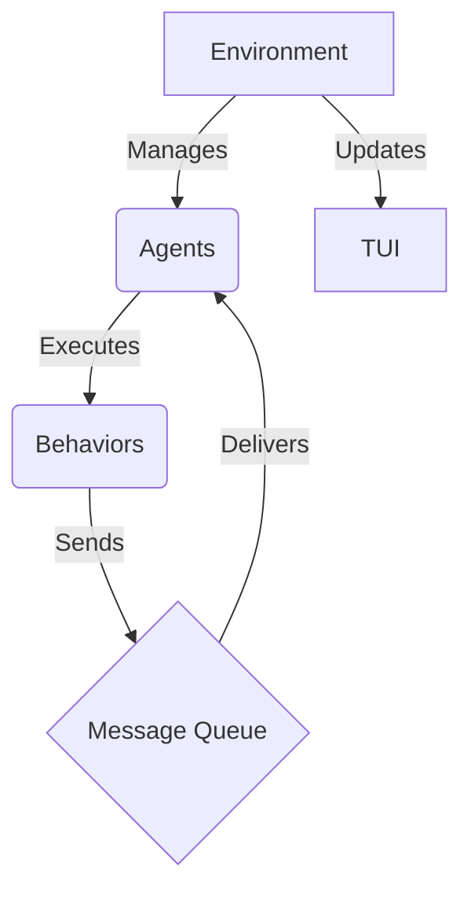

---

# Multi-Agent AI System in Rust


[](https://opensource.org/licenses/MIT)

## Overview


This project implements a **modular multi-agent system** in Rust. It demonstrates how agents can communicate, interact, and execute behaviors in a simulated environment. The system is designed to be extensible, allowing developers to add new agent types, behaviors, and simulation logic with minimal changes to the core architecture.


Key features include:
- **Message-passing communication**: Agents exchange messages via a centralized message queue.
- **Tick-based simulation**: The environment processes agent actions and messages in discrete time steps.
- **Extensible architecture**: Add new agent types and behaviors without modifying existing code.
- **Error handling**: Built with robust error handling using the `anyhow` crate.
- **Scalable design**: Modular components allow for easy testing, debugging, and extension.

---

## Table of Contents

1. [Features](#features)
2. [Project Structure](#project-structure)
3. [Getting Started](#getting-started)
   - [Prerequisites](#prerequisites)
   - [Installation](#installation)
   - [Running the Simulation](#running-the-simulation)
4. [Adding New Agents](#adding-new-agents)
5. [Example Output](#example-output)
6. [Configuration](#configuration)
7. [Testing](#testing)
8. [Contributing](#contributing)
9. [License](#license)

---

## Features

- **Agent Types**: Multiple agent types (`BasicAgent`, `LearningAgent`) with distinct behaviors.
- **Message Queue**: Centralized message routing for inter-agent communication.
- **Simulation Loop**: Tick-based execution loop for processing agent actions and messages.
- **Extensibility**: Easily add new agent behaviors or modify the environment.
- **Error Handling**: Graceful error reporting using `anyhow`.
- **Serialization Support**: Optional support for saving/loading agent states (via Serde).

---

## Architecture

The system is designed with a modular architecture that separates concerns and promotes extensibility. The main components are:

- **Environment**: The core of the simulation, responsible for managing agents, processing messages, and executing ticks.
- **Agents**: Autonomous entities that can communicate, make decisions, and execute behaviors.
- **Behaviors**: The logic that defines how an agent acts and reacts to messages.
- **Message Queue**: A centralized queue for inter-agent communication.
- **TUI**: A terminal user interface for visualizing the simulation.

Here is a diagram of the architecture:



## Project Structure

The project is organized into modular components for clarity and maintainability:

```
ai-agents/
├── Cargo.toml          # Project metadata and dependencies
├── README.md           # This documentation
├── config.json         # Configuration file for agents and providers
└── src/
    ├── main.rs         # Entry point for the application
    ├── agents/         # Agent implementations
    │   ├── mod.rs      # Module declaration for agents
    │   ├── agent.rs    # Base agent implementation
    │   ├── basic_agent.rs  # Basic agent behavior
    │   ├── learning_agent.rs # Learning agent behavior
    │   ├── researcher_agent.rs # Researcher agent behavior
    │   └── writer_agent.rs # Writer agent behavior
    ├── behaviors/      # Behavior traits and implementations
    │   ├── mod.rs      # Module declaration for behaviors
    │   └── behavior_trait.rs # Core behavior trait
    ├── tools/          # Tools for agents
    │   ├── mod.rs      # Module declaration for tools
    │   └── web_search.rs # Web search tool
    ├── environment.rs  # Environment management and simulation loop
    ├── message.rs      # Message struct and utilities
    └── config.rs       # Configuration system
```

---

## Getting Started

### Prerequisites

- **Rust**: Ensure you have Rust installed. You can install it from [rust-lang.org](https://www.rust-lang.org/tools/install).
- **Cargo**: The Rust package manager (comes bundled with Rust).

### Installation

1. Clone the repository:
   ```bash
   git clone https://github.com/your-repo/ai-agents.git
   cd ai-agents
   ```

2. Build the project:
   ```bash
   cargo build
   ```

### Running the Simulation

Run the simulation with default settings:
```bash
cargo run
```

You can also specify the number of ticks for the simulation:
```bash
cargo run -- <number_of_ticks>
```

For example:
```bash
cargo run -- 10
```

---

## Adding New Agents

To add a new agent type:
1. Create a new file in `src/agents/` (e.g., `advanced_agent.rs`).
2. Implement the `AgentBehavior` trait for your new agent.
3. Register the new agent type in `src/agents/mod.rs`:
   ```rust
   pub mod advanced_agent;
   ```
4. Add a new variant to the `AgentType` enum in `src/agents/agent.rs`:
   ```rust
   pub enum AgentType {
       Basic,
       Learning,
       Advanced,
   }
   ```
5. Update the `Agent::new()` constructor to handle the new type:
   ```rust
   match agent_type {
       AgentType::Advanced => Box::new(advanced_agent::AdvancedAgent::default()),
   }
   ```

---

## Example Output

When running the simulation, you might see output like this:

```
[LearningAgent] Learning: Hello from BasicAgent #0
[BasicAgent] Received: Learned: Hello from BasicAgent #0
[LearningAgent] Learning: Hello from BasicAgent #3
[BasicAgent] Received: Learned: Hello from BasicAgent #3
```

Each line represents an agent receiving or processing a message.

---

## Configuration

The system supports runtime configuration via `src/config.rs`. You can customize parameters such as:
- `message_limit`: Maximum number of messages processed per tick.
- `learning_capacity`: Maximum knowledge size for learning agents.

To use custom configurations, pass a `Config` instance when creating the environment:
```rust
let config = Config { message_limit: 50, learning_capacity: 500 };
let mut env = Environment::with_config(config);
```

---

## Testing

The project includes tests for critical components. Run all tests with:
```bash
cargo test
```

To add new tests:
1. Create a new file in `tests/` (e.g., `test_agents.rs`).
2. Write test cases using Rust's built-in testing framework.

---

## Contributing

We welcome contributions! Here are some ways you can help:
- **Bug Reports**: Open an issue if you find a bug.
- **Feature Requests**: Suggest new features or improvements.
- **Code Contributions**: Fork the repository, make changes, and submit a pull request.
- **Documentation**: Improve the README or add comments to the code.

Before contributing, please review the [Code of Conduct](CODE_OF_CONDUCT.md).

---

## License

This project is licensed under the **MIT License**. See the [LICENSE](LICENSE) file for details.

---

## Acknowledgments

- Inspired by multi-agent systems in artificial intelligence research.
- Built with Rust's robust concurrency and safety features.

---

